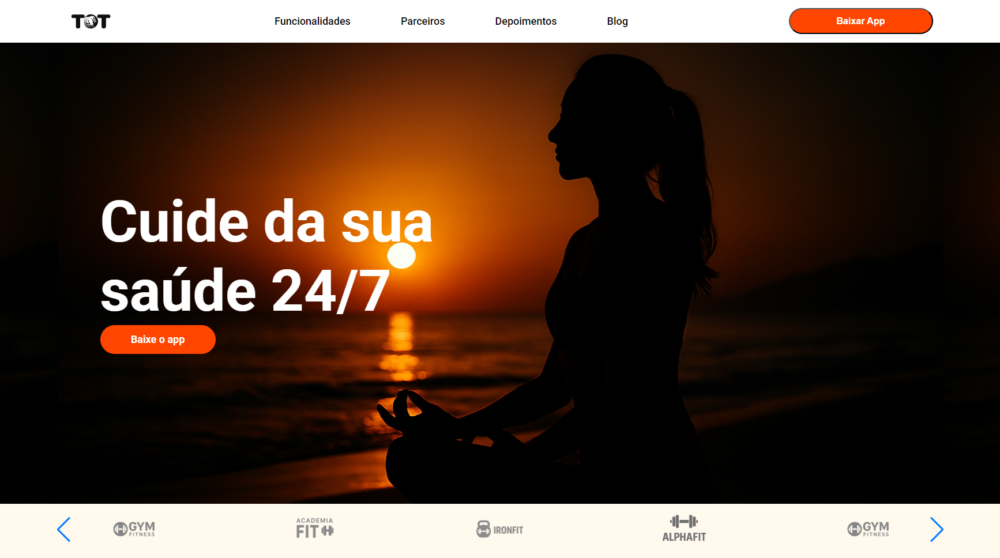
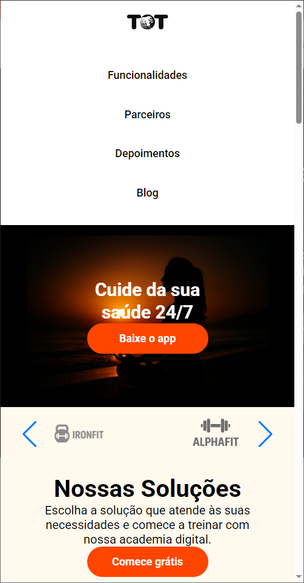

# Nome do Projeto

Uma landing page responsiva inspirado no site da TOT, com seção, carrossel de parceiros, soluções, indicadores e formulário.

---

## 📸 Capturas de Tela

### Desktop



### Mobile



---

## 🚀 Tecnologias

- HTML5  
- CSS3
- JavaScript
- [Swiper.js](https://swiperjs.com)  

---

## ⚙️ Instalação e Uso

1. Clone este repositório  
   ```bash
   git clone https://github.com/Baphomet/teste-TOT.git

2. Entre na pasta do projeto
   cd teste-TOT

3. Abra o index.html no seu navegador
   ou use um servidor local (Live Server, http-server, etc)
